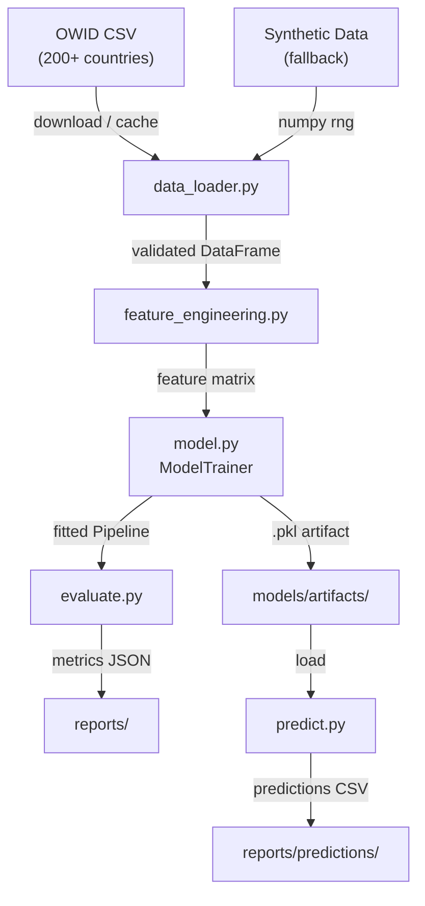
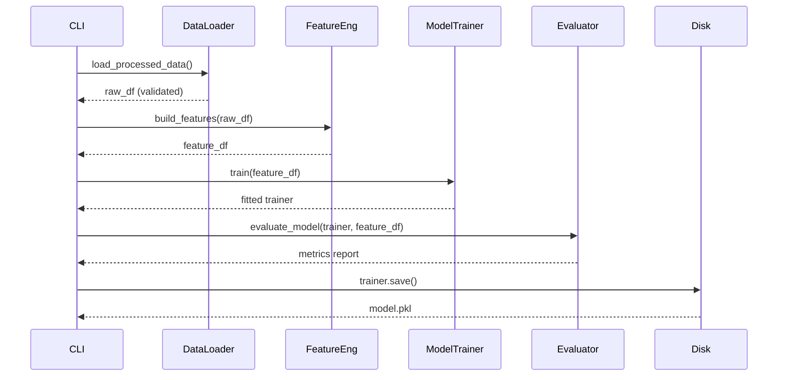

# Architecture — COVID-19 ML Prediction

## Pipeline Overview

## Module Responsibilities

| Module | Responsibility |
|---|---|
| `config.py` | Centralised configuration via dataclasses + env vars |
| `data_loader.py` | Download, cache, validate OWID dataset; synthetic fallback |
| `feature_engineering.py` | Time-series features: lags, rolling stats, growth rates |
| `model.py` | Multi-algorithm ModelTrainer (RF, XGB, LGB, Ridge) + sklearn Pipeline |
| `evaluate.py` | Chronological train/test split, metrics, per-country breakdown |
| `predict.py` | Inference on new data using persisted model artifact |

## Data Flow

## Technology Stack

| Layer | Technology |
|---|---|
| Language | Python 3.10+ |
| ML Framework | scikit-learn, XGBoost (opt.), LightGBM (opt.) |
| Data Processing | pandas, numpy |
| Configuration | dataclasses + python-dotenv |
| Containerisation | Docker (multi-stage), Docker Compose |
| CI/CD | GitHub Actions |
| Linting | ruff |
| Testing | pytest + pytest-cov |
| Experiment tracking | MLflow (optional, via config) |

## Design Decisions

1. **Chronological splits** — never random splits for time-series data; avoids future leakage.
2. **Synthetic fallback** — enables offline development and CI without network access.
3. **sklearn Pipeline** — bundles imputation + scaling + estimator so train/predict use the same transformations automatically.
4. **Multi-stage Docker** — separates build dependencies from runtime image, reducing final image size by ~60%.
5. **Dataclass config** — type-safe, IDE-friendly, validated at startup; no magic strings.
